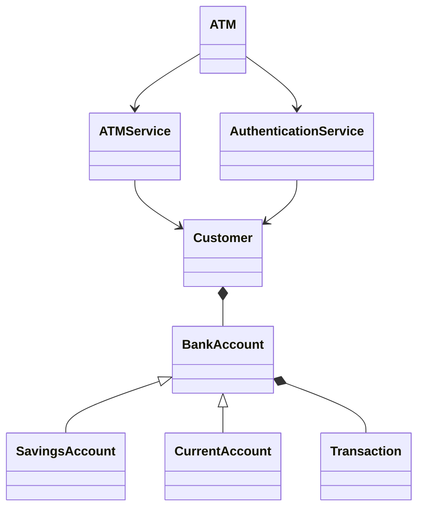
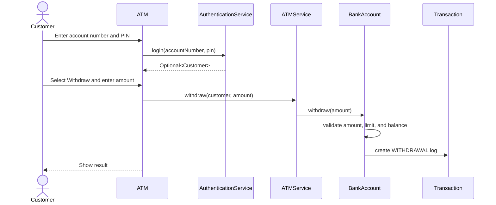

# ATM Machine Application

This is a complete menu-driven ATM Machine application built with Java 21, Maven, OOP principles, Collections, and exception handling.

## Project Structure

```text
ATM/
+-- pom.xml
+-- README.md
+-- docs/
|   +-- uml-class-diagram.mmd
|   +-- withdraw-sequence-diagram.mmd
+-- src/
    +-- main/java/com/atm/
    |   +-- ATM.java
    |   +-- exception/
    |   +-- model/
    |   +-- service/
    +-- test/java/com/atm/
```

## How to Run

```bash
mvn clean test
mvn exec:java
```

Demo customer accounts:

| Name | Account Number | PIN |
| --- | --- | --- |
| Asha Sharma | `1001001001` | `1234` |
| Ravi Kumar | `1001001002` | `2345` |
| Neha Patel | `1001001003` | `3456` |

Admin login:

| Username | PIN |
| --- | --- |
| `admin` | `0000` |

## Features

- Customer login with account number and PIN.
- Maximum 3 failed login attempts before account lock.
- Balance enquiry.
- Cash deposit with positive amount validation.
- Cash withdrawal with insufficient funds and daily limit checks.
- Fund transfer between accounts.
- Transaction history with date and time.
- Mini statement for the last 5 transactions.
- PIN change with 4-digit validation.
- Admin view of all accounts.
- Exception handling for invalid menu input, invalid amount, invalid PIN, locked accounts, insufficient balance, and withdrawal limit violations.

## OOP Principles Used

- Encapsulation: Account state such as PIN, balance, lock status, and transactions is private inside `BankAccount`.
- Abstraction: `BankAccount` defines common account behavior and requires subclasses to provide `getAccountType()`.
- Inheritance: `SavingsAccount` and `CurrentAccount` extend `BankAccount`.
- Polymorphism: The system works with the `BankAccount` type while runtime objects can be savings or current accounts.

## Collections Used

- `HashMap<String, Customer>` stores customers by account number for fast lookup.
- `HashMap<String, Integer>` tracks failed login attempts.
- `ArrayList<Transaction>` stores each account's transaction history.

## Class and Method Explanation

### `ATM`

Main console entry point.

- `main(String[] args)`: Creates demo customers, services, and starts the ATM.
- `start()`: Runs the login loop for customer or admin access.
- `showCustomerMenu(Customer customer)`: Displays customer operations and returns whether the application should continue.
- `handleDeposit(Customer customer)`: Reads an amount and deposits it.
- `handleWithdraw(Customer customer)`: Reads an amount and withdraws it.
- `handleTransfer(Customer customer)`: Reads target account and amount, then transfers funds.
- `handlePinChange(Customer customer)`: Reads and updates a new PIN.
- `showAdminMenu()`: Displays admin features.
- `printAllAccounts()`: Prints all customer accounts with status.
- `readInt(String prompt)`: Safely reads menu choices.
- `readAmount(String prompt)`: Safely reads money amounts.

### `BankAccount`

Abstract base class for bank accounts.

- `deposit(BigDecimal amount)`: Adds money after positive amount validation.
- `withdraw(BigDecimal amount)`: Withdraws money after amount, balance, and daily limit checks.
- `debitForTransfer(BigDecimal amount, String targetAccountNumber)`: Debits source account during transfer.
- `creditFromTransfer(BigDecimal amount, String sourceAccountNumber)`: Credits target account during transfer.
- `changePin(String newPin)`: Updates PIN after 4-digit validation.
- `getTransactions()`: Returns full transaction history.
- `getMiniStatement(int count)`: Returns recent transactions.
- `lock()`: Locks the account after repeated failed login attempts.
- `getAccountType()`: Abstract method implemented by subclasses.

### `SavingsAccount` and `CurrentAccount`

Concrete account types. They override `getAccountType()` to demonstrate polymorphism.

### `Customer`

Represents a bank customer.

- `getCustomerId()`: Returns customer ID.
- `getName()`: Returns customer name.
- `getAccount()`: Returns the customer's bank account.

### `Transaction`

Immutable transaction log entry.

- Stores transaction type, amount, timestamp, description, and balance after transaction.
- `toString()`: Formats transaction details for console output.

### `AuthenticationService`

Handles login rules.

- `login(String accountNumber, String pin)`: Validates credentials, tracks failed attempts, and locks the account after 3 failures.
- `isAdminLogin(String username, String pin)`: Validates admin credentials.

### `ATMService`

Business service for ATM operations.

- `checkBalance(Customer customer)`: Returns account balance.
- `deposit(Customer customer, BigDecimal amount)`: Deposits funds.
- `withdraw(Customer customer, BigDecimal amount)`: Withdraws funds.
- `transfer(Customer sourceCustomer, String targetAccountNumber, BigDecimal amount)`: Transfers funds between accounts.
- `getTransactionHistory(Customer customer)`: Returns all transactions.
- `getMiniStatement(Customer customer)`: Returns last 5 transactions.
- `changePin(Customer customer, String newPin)`: Changes account PIN.
- `getAllCustomers()`: Supports admin account listing.
- `createDemoCustomers()`: Seeds sample accounts.

## UML Class Diagram

Mermaid source is available at `docs/uml-class-diagram.mmd`.



## Withdraw Transaction Sequence Diagram

Mermaid source is available at `docs/withdraw-sequence-diagram.mmd`.



## Sample Test Cases and Expected Outputs

| Test Case | Input | Expected Output |
| --- | --- | --- |
| Valid login | Account `1001001001`, PIN `1234` | Customer menu is displayed |
| Invalid login 3 times | Account `1001001001`, PIN `0000` repeated 3 times | Account locked message |
| Balance enquiry | Select `1` | Current balance displayed |
| Deposit success | Select `2`, amount `500` | Deposit successful and balance increases |
| Deposit invalid amount | Select `2`, amount `0` | Error: Deposit amount must be positive |
| Withdraw success | Select `3`, amount `1000` | Withdrawal successful and balance decreases |
| Withdraw insufficient funds | Select `3`, amount greater than balance | Error: Insufficient balance for withdrawal |
| Daily limit exceeded | Withdraw more than account daily limit | Error: Daily withdrawal limit exceeded |
| Transfer success | Select `4`, target `1001001002`, amount `500` | Transfer successful; both accounts get transaction logs |
| Change invalid PIN | Select `6`, PIN `12345` | Error: PIN must be exactly 4 digits |
| Admin account view | Username `admin`, PIN `0000`, select `1` | Table of all accounts |

## Advanced Full Stack Version

The requested resume-level full stack version would be a separate Spring Boot and React system. A recommended architecture:

- Backend: Java 21, Spring Boot, Spring Security, JWT, JPA/Hibernate, MySQL, Redis, Swagger/OpenAPI.
- Frontend: React with protected routes for `ADMIN` and `CUSTOMER`.
- Testing: JUnit 5, Mockito, Testcontainers for integration tests.
- Deployment: Docker Compose for backend, frontend, MySQL, and Redis.
- CI/CD: GitHub Actions workflow running build, test, Docker image build, and optional deployment.

This repository currently implements the complete Java 21 Maven console application requested in the main deliverables.
