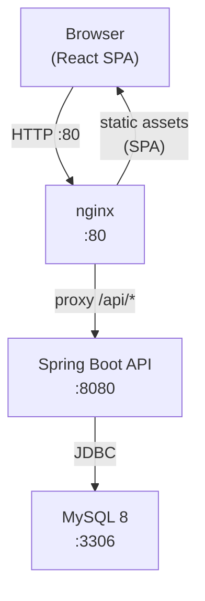
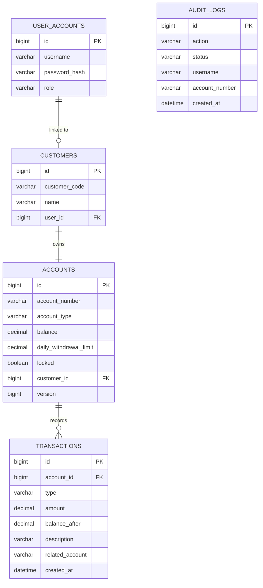

# Architecture

## Overview

ATM Banking System is a full-stack web application built with a React single-page application frontend and a Spring Boot REST API backend, persisted to MySQL.

## High-level component diagram



## Technology stack

| Layer | Technology |
|-------|------------|
| Frontend | React 19 + TypeScript + Vite 8 |
| Routing | React Router v7 |
| HTTP client | Axios (with JWT interceptors) |
| Styling | Plain CSS (no framework) |
| Backend | Spring Boot 3.3.5 / Java 21 |
| Security | Spring Security + JWT (jjwt 0.12.6) |
| Persistence | Spring Data JPA + Hibernate 6 |
| Database | MySQL 8 (H2 for tests) |
| API docs | SpringDoc OpenAPI / Swagger UI |
| Container | Docker Compose (3 services) |
| CI | GitHub Actions |

## Backend package structure

```
com.bank
├── config/          SecurityConfig, OpenApiConfig, DataSeeder
├── controller/      AuthController, AccountController, TransactionController,
│                    TransferController, AdminController, UserController
├── domain/          BankAccount (abstract), SavingsAccount, CurrentAccount,
│                    Customer, UserAccount, Transaction, AuditLog …
├── dto/             Request/response records (AccountResponse, LoginResponse …)
├── exception/       Domain exceptions + GlobalExceptionHandler
├── repository/      Spring Data JPA interfaces
├── security/        JwtTokenProvider, JwtAuthenticationFilter,
│                    CustomUserDetailsService …
├── service/         AccountService, AuthService, TransferService,
│                    AuditService, TransactionService …
└── util/            PinPolicy
```

## Domain model



## Key design decisions

### Single-table inheritance
`BankAccount` uses `SINGLE_TABLE` inheritance with a `account_type` discriminator. `SavingsAccount` and `CurrentAccount` share the same table, keeping queries simple.

### IDOR prevention
Customer-facing account queries always join through `Customer → UserAccount` so a customer can never read or modify another customer's account, even if they know the account number.

### Pessimistic locking for transfers
`TransferService` acquires `SELECT ... FOR UPDATE` locks on both accounts in a deterministic order (lower account ID first) to prevent deadlocks.

### Optimistic locking
`BankAccount` carries a `@Version` field. Concurrent deposit/withdraw/transfer operations on the same account will produce an `OptimisticLockingFailureException` instead of a silent data race.

### Audit log isolation
`AuditService` runs in `REQUIRES_NEW` propagation so audit records persist even when the outer transaction rolls back.
