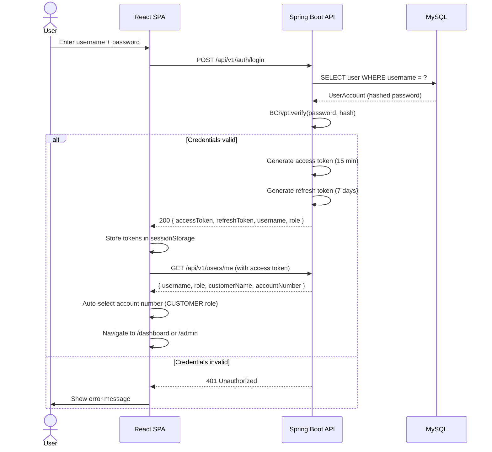
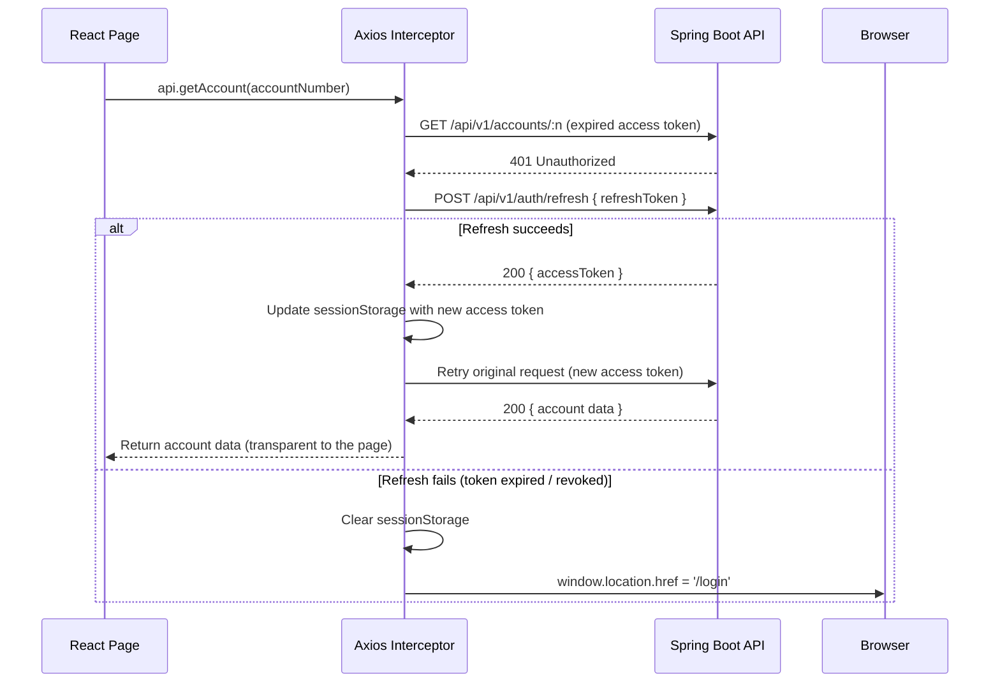
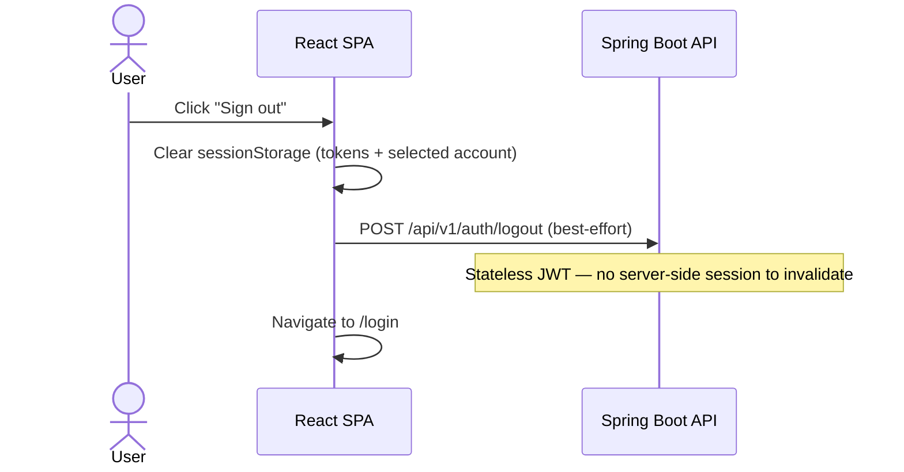

# Authentication Flow

## Token architecture

The system uses a dual-token JWT scheme:

| Token | Lifetime | Purpose |
|-------|----------|---------|
| Access token | 15 minutes | Bearer token on every API request |
| Refresh token | 7 days | Obtain a new access token without re-login |

Both tokens are stored in `sessionStorage` under the key `atm.auth.session`. They are cleared when the browser tab is closed.

## Login sequence

## Silent token refresh

The Axios client intercepts every 401 response (excluding auth endpoints) and attempts a silent refresh before surfacing the error to the page.

## Logout sequence

## Role-based access control

| Role | Accessible routes |
|------|-------------------|
| `CUSTOMER` | `/dashboard`, `/account`, `/deposit`, `/withdraw`, `/transfer`, `/pin`, `/transactions`, `/mini-statement` |
| `ADMIN` | `/admin`, `/admin/accounts`, `/admin/lock-unlock` |

The React router's `ProtectedRoute` component enforces roles on the client. Spring Security's `@PreAuthorize` and URL rules enforce them on the server independently.

## Password and PIN hashing

| Credential | Algorithm | Notes |
|------------|-----------|-------|
| Login password | BCrypt (strength 10) | Verified by `BCryptPasswordEncoder` in `AuthService` |
| Transaction PIN | BCrypt (strength 10) | Stored as `pin_hash`; verified in `AccountService` |

Passwords and PINs are never stored or transmitted in plain text.
