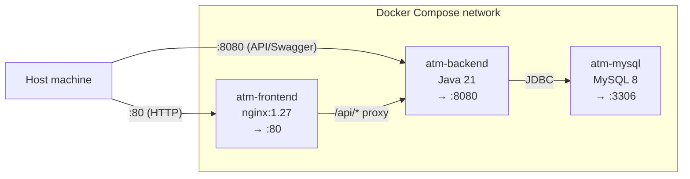

# Deployment Guide

## Prerequisites

- Docker Desktop 4.x or Docker Engine 24+ with Compose v2
- Git

## Quick start

```bash
# 1. Clone the repository
git clone <repository-url>
cd ATM

# 2. Copy the environment template and fill in secrets
cp .env.example .env
# Edit .env — at minimum change JWT_SECRET to a strong random value:
# openssl rand -base64 64

# 3. Start all services
docker compose up --build -d

# 4. Open the application
open http://localhost          # React frontend
open http://localhost:8080/swagger-ui/index.html  # API docs
```

## Demo accounts (seeded on first start)

| Username | Password | Role | Account | PIN |
|----------|----------|------|---------|-----|
| asha | Password@123 | CUSTOMER | 1001001001 | 1234 |
| ravi | Password@123 | CUSTOMER | 1001001002 | 2345 |
| neha | Password@123 | CUSTOMER | 1001001003 | 3456 |
| admin | Admin@123 | ADMIN | — | — |

## Service overview



| Container | Published port | Purpose |
|-----------|---------------|---------|
| atm-frontend | 80 | Serves the React SPA and proxies `/api/*` to the backend |
| atm-backend | 8080 | Spring Boot REST API + Swagger UI |
| atm-mysql | 3306 | Persistent database (volume `atm-mysql-data`) |

## Environment variables

Copy `.env.example` to `.env`. All variables have safe defaults for local development.

| Variable | Default | Description |
|----------|---------|-------------|
| `MYSQL_ROOT_PASSWORD` | `rootpassword` | MySQL root password |
| `MYSQL_DATABASE` | `banking_db` | Database name |
| `MYSQL_USER` | `banking` | Application DB user |
| `MYSQL_PASSWORD` | `banking` | Application DB password |
| `JWT_SECRET` | (dev key) | Base-64 encoded HMAC-SHA256 secret — **change in production** |
| `JWT_ACCESS_EXPIRATION` | `900000` | Access token lifetime in milliseconds (15 min) |
| `JWT_REFRESH_EXPIRATION` | `604800000` | Refresh token lifetime in milliseconds (7 days) |

## Common operations

```bash
# View logs
docker compose logs -f backend
docker compose logs -f frontend

# Stop all services
docker compose down

# Destroy database volume (wipes all data)
docker compose down -v

# Rebuild a single service after code changes
docker compose build backend
docker compose up -d backend
```

## Running in development (without Docker)

### Backend

```bash
# Requires: Java 21, MySQL 8 running on localhost:3306
cd backend
./mvnw spring-boot:run
# API available at http://localhost:8080
# Swagger UI at  http://localhost:8080/swagger-ui/index.html
```

### Frontend

```bash
# Requires: Node 22+, backend running on :8080
cd frontend
npm install
npm run dev
# SPA available at http://localhost:5173
```

The Vite dev server proxies `/api` requests to `http://localhost:8080` automatically.

## Production checklist

- [ ] Replace `JWT_SECRET` with a strong random value (`openssl rand -base64 64`)
- [ ] Set strong MySQL passwords in `.env`
- [ ] Place a TLS-terminating reverse proxy (nginx, Caddy, or a load balancer) in front of port 80
- [ ] Do not expose port 3306 publicly — remove or restrict the MySQL `ports` mapping
- [ ] Consider setting `SPRING_PROFILES_ACTIVE=prod` and disabling `app.seed-demo-data`
